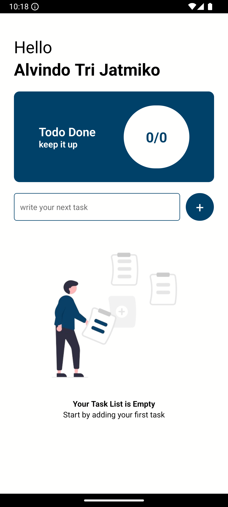
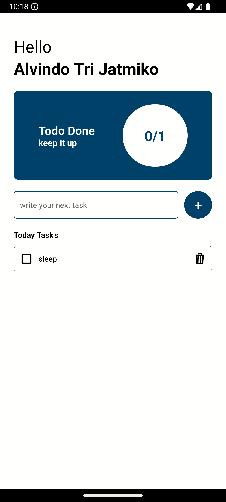
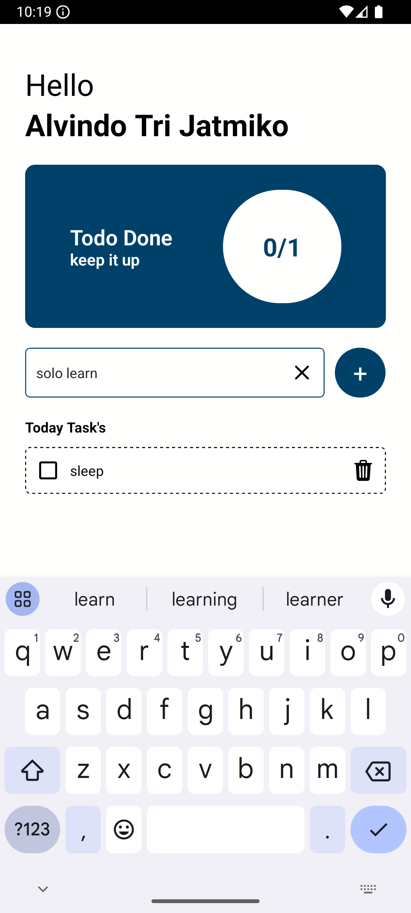
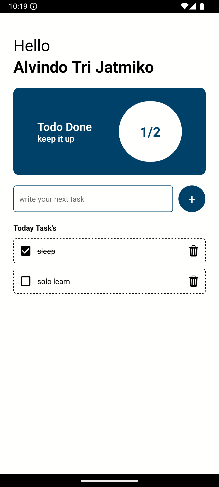
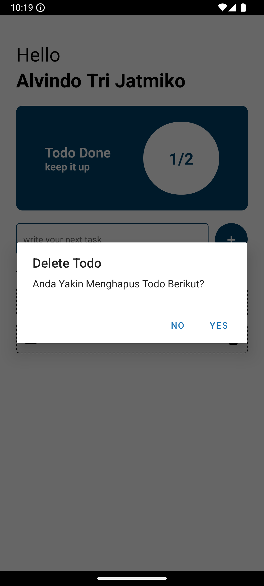

## Mobile Todo App
Basic todo app build with react native and expo

## How to run
```
git clone https://github.com/Garongan/mobile-todo.git
```

```
yarn install
```

```
yarn android
```

## Screenshot app




